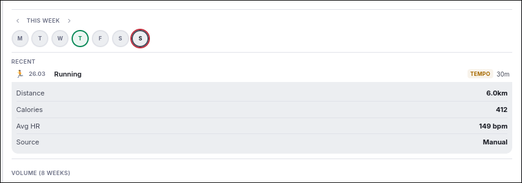

# Polar AI Coach

AI-powered training coach that connects to your Polar watch data. Personalized daily training advice, recovery insights, stress monitoring, and adaptive training plans — all from your browser.




## Features

**Recovery & Readiness**
- Readiness score — composite of sleep, recovery, and stress with contributor breakdown
- Sleep quality analysis with stage breakdown (light/deep/REM)
- Nightly Recharge tracking (ANS charge, HRV, resting HR, breathing rate)
- Stress score derived from HRV and HR baselines, with real-time estimate
- Click-to-expand score cards with detailed metrics

**Training**
- Manual exercise logging with distance, calories, HR, and sport type
- Auto-classified training benefit tags (Base Building, Tempo, HIIT, Strength, Recovery)
- Weekly and monthly training summaries with navigable week view
- 8-week progressive volume chart
- Running pace zones calculated from MAS (5 zones: Easy to Speed)
- Race time predictions (5K, 10K, Half Marathon, Marathon) from VO2max
- AI Insight button on each exercise for per-session analysis

**Heart Rate**
- 24-hour continuous HR chart on a proper time axis (0-24h)
- Interactive hover with crosshair tooltip
- Sleep zone overlay toggle
- Responsive to theme changes

**Calendar & Events**
- Monthly calendar with exercise days highlighted (green in dark, red in light)
- Orienteering event days (Helsingin Suunnistajat Iltarastit) with purple fill
- Planned session indicators (small orange dots)
- Click any day to see event details (location, address)

**AI Coach (via OpenRouter)**
- Smart model routing: GPT-5.4 Nano for quick tasks, Claude Sonnet 4.6 for deep analysis
- Daily personalized advice factoring recovery, weather, training load, and athlete profile
- Adaptive training plans (general fitness, running, race goals, orienteering)
- Plans adjust daily based on actual recovery data
- Weekly reports (cheap model) and monthly deep analysis (premium model)
- Per-session AI insight with one click
- Orienteering event integration (iltarastit.fi calendar)
- Weather-aware recommendations via wttr.in
- Conservative coaching: matches intensity to actual training volume, not just recovery

**Athlete Profile**
- Full physiology data: VO2max, max HR, resting HR, aerobic/anaerobic thresholds, MAS
- HR zones (5 zones from Polar Flow settings)
- Work schedule, lifestyle, equipment, goals, injuries
- Switchable AI model (6 options from OpenRouter)

**Other**
- Dark/light theme following system preference
- Installable as PWA
- Instant client-side date navigation (no page reloads)
- 7-day and monthly trend analysis with direction indicators
- Weather display with manual location override
- Server-side sessions (no cookie size limits)

## Setup

### 1. Polar AccessLink API

1. Create an account at [Polar Flow](https://flow.polar.com)
2. Register at [admin.polaraccesslink.com](https://admin.polaraccesslink.com)
3. Create a client with callback URL: `http://localhost:5000/callback`
4. Note your Client ID and Client Secret

### 2. OpenRouter API (for AI features)

1. Sign up at [openrouter.ai](https://openrouter.ai)
2. Create an API key
3. Add credits (GPT-5.4 Nano costs ~$0.15/month for casual use)

### 3. Install & Run

```bash
cd polar-coach
python3 -m venv venv
source venv/bin/activate
pip install -r requirements.txt
cp .env.example .env
# Edit .env with your API keys
./run.sh
```

Opens http://localhost:5000 — click "Connect with Polar Flow" to authorize.

## AI Model Routing

| Task | Model | Cost |
|------|-------|------|
| Session insights | GPT-5.4 Nano | ~$0.001/request |
| Weekly reports | GPT-5.4 Nano | ~$0.001/request |
| Daily advice (AI chat) | Claude Sonnet 4.6 | ~$0.012/request |
| Monthly reports | Claude Sonnet 4.6 | ~$0.012/request |
| Training plans | Profile-selected | Varies |

## Tech Stack

- **Backend:** Python / Flask
- **Frontend:** Vanilla JS, HTML Canvas charts
- **AI:** OpenRouter (GPT-5.4 Nano + Claude Sonnet 4.6)
- **Data:** Polar AccessLink API, local JSON storage
- **Weather:** wttr.in (no API key needed)
- **Events:** iltarastit.fi schedule scraping
- **Sessions:** Server-side via cachelib

## Project Structure

```
polar-coach/
├── app.py              # Flask routes, session management, API endpoints
├── polar_client.py     # Polar AccessLink API client (OAuth2, data fetching)
├── coach.py            # Scoring engine (readiness, stress, insights, pace zones, race predictions)
├── ai_coach.py         # AI integration (model routing, prompts, weather)
├── local_data.py       # Local storage (exercises, profile, plans, events, journal)
├── run.sh              # Launch script
├── templates/
│   ├── base.html       # Layout, navbar, theme toggle
│   ├── index.html      # Landing page
│   ├── dashboard.html  # Main 3-column dashboard
│   ├── profile.html    # Athlete profile editor
│   └── session.html    # Exercise detail view
├── static/
│   ├── style.css       # Dark/light themes
│   └── manifest.json   # PWA manifest
├── data/               # Local data (gitignored)
├── .env.example
└── requirements.txt
```

## Data Privacy

- All data stays local — no external storage, no telemetry
- API keys in `.env` (gitignored)
- Personal data in `data/` (gitignored)
- Polar OAuth tokens in server-side sessions (not cookies)
- AI queries go through OpenRouter — review their [privacy policy](https://openrouter.ai/privacy)

## License

MIT
