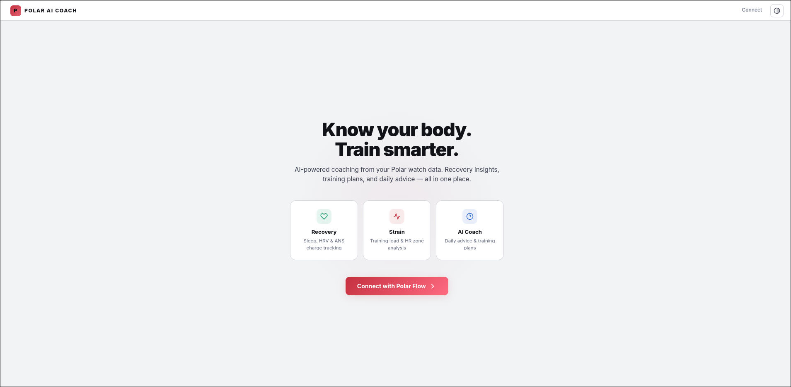
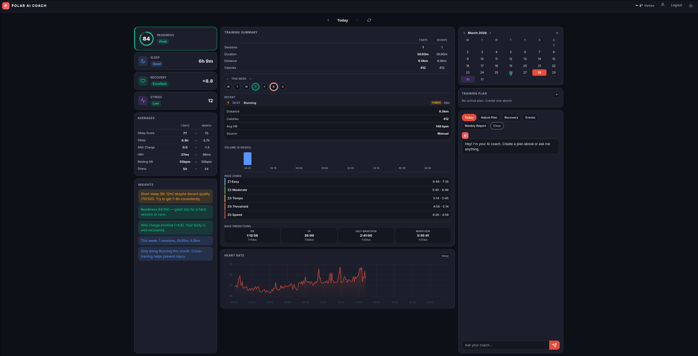
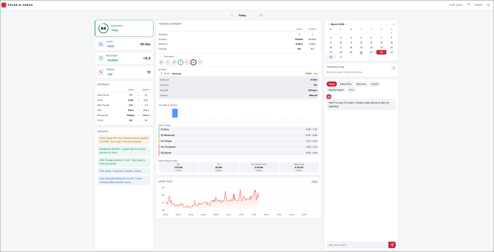
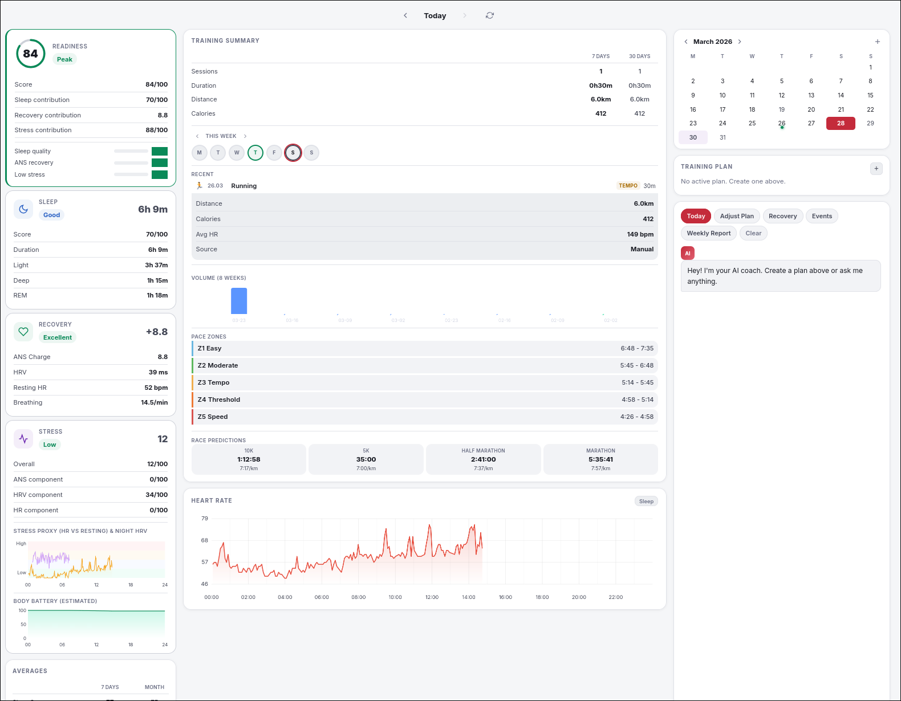

# Polar AI Coach

AI-powered training coach that connects to your Polar watch data. Get personalized daily training advice, recovery insights, stress monitoring, and adaptive training plans — all from your browser.






## Features

**Recovery & Readiness**
- Readiness score (composite of sleep, recovery, stress) with contributor breakdown
- Sleep quality analysis with stage breakdown (light/deep/REM)
- Nightly Recharge tracking (ANS charge, HRV, resting HR, breathing rate)
- Derived stress score from HRV and HR baselines
- Click-to-expand score cards with detailed metrics

**Heart Rate**
- 24-hour continuous HR chart with proper time axis
- Interactive hover with crosshair and tooltip
- Sleep zone overlay toggle

**Training**
- Manual exercise logging (running, strength, etc.) with distance tracking
- Auto-classified training benefit tags (Base Building, Tempo, HIIT, Strength, Recovery, etc.)
- Weekly and monthly training summaries (sessions, duration, distance, calories)
- 8-week progressive volume chart
- Pace zones calculated from MAS (5 zones: Easy → Speed)
- Race predictions (5K, 10K, Half Marathon, Marathon) based on VO2max
- Mini calendar with session dots and plan indicators
- Training insights (volume trends, rest day reminders, cross-training suggestions)

**AI Coach (via OpenRouter)**
- Daily personalized advice based on recovery, weather, and training load
- Adaptive training plans (general fitness, running, race goals, orienteering)
- Plans adjust daily based on your actual recovery data
- Weekly AI-generated training reports
- Orienteering event integration (Helsingin Suunnistajat Iltarastit calendar)
- Weather-aware recommendations (indoor/outdoor based on conditions)
- Full athlete profile with HR zones, VO2max, thresholds from Polar Flow

**Journal**
- Daily mood tracking (1–5 scale)
- Fatigue level logging
- Nutrition status (good/ok/poor)
- Free-text notes

**Other**
- Dark/light theme with system preference detection
- Installable as PWA (Progressive Web App)
- Instant client-side date navigation (no page reloads)
- 7-day and monthly trend analysis with direction indicators
- Editable athlete profile for personalized coaching
- Weather display with manual location override

## Setup

### 1. Polar AccessLink API

1. Create an account at [Polar Flow](https://flow.polar.com)
2. Register as a developer at [admin.polaraccesslink.com](https://admin.polaraccesslink.com)
3. Create a new client with callback URL: `http://localhost:5000/callback`
4. Note your Client ID and Client Secret

### 2. OpenRouter API (for AI features)

1. Sign up at [openrouter.ai](https://openrouter.ai)
2. Create an API key
3. Add credits (Gemini 2.0 Flash is very affordable)

### 3. Install & Run

```bash
cd polar-coach
python3 -m venv venv
source venv/bin/activate
pip install -r requirements.txt
cp .env.example .env
# Edit .env with your API keys
python app.py
```

Open http://localhost:5000 and click "Connect with Polar Flow" to authorize.

## Tech Stack

- **Backend:** Python / Flask
- **Frontend:** Vanilla JS, HTML Canvas charts
- **AI:** OpenRouter (Gemini 2.0 Flash) via OpenAI-compatible API
- **Data:** Polar AccessLink API, local JSON storage
- **Weather:** wttr.in (no API key needed)
- **Orienteering:** iltarastit.fi schedule scraping

## Project Structure

```
polar-coach/
├── app.py              # Flask routes, session management, API endpoints
├── polar_client.py     # Polar AccessLink API client (OAuth2, data fetching)
├── coach.py            # Scoring engine (readiness, stress, insights, summaries)
├── ai_coach.py         # AI integration (daily advice, training plans, weather)
├── local_data.py       # Local storage (exercises, profile, plans, events)
├── templates/          # Jinja2 HTML templates
│   ├── base.html       # Layout, navbar, theme toggle
│   ├── index.html      # Landing page
│   ├── dashboard.html  # Main dashboard (3-column layout)
│   ├── profile.html    # Athlete profile editor
│   └── session.html    # Exercise detail view
├── static/
│   ├── style.css       # Full CSS (dark/light themes)
│   └── manifest.json   # PWA manifest
├── data/               # Local data (gitignored)
│   ├── exercises.json
│   ├── profile.json
│   ├── training_plan.json
│   └── sessions/
├── .env.example
└── requirements.txt
```

## Data Privacy

- All data stays local — no external storage, no telemetry
- API keys stored in `.env` (gitignored)
- Personal data in `data/` directory (gitignored)
- Polar OAuth tokens stored in server-side sessions (not cookies)
- AI queries go through OpenRouter — review their privacy policy

## License

MIT
